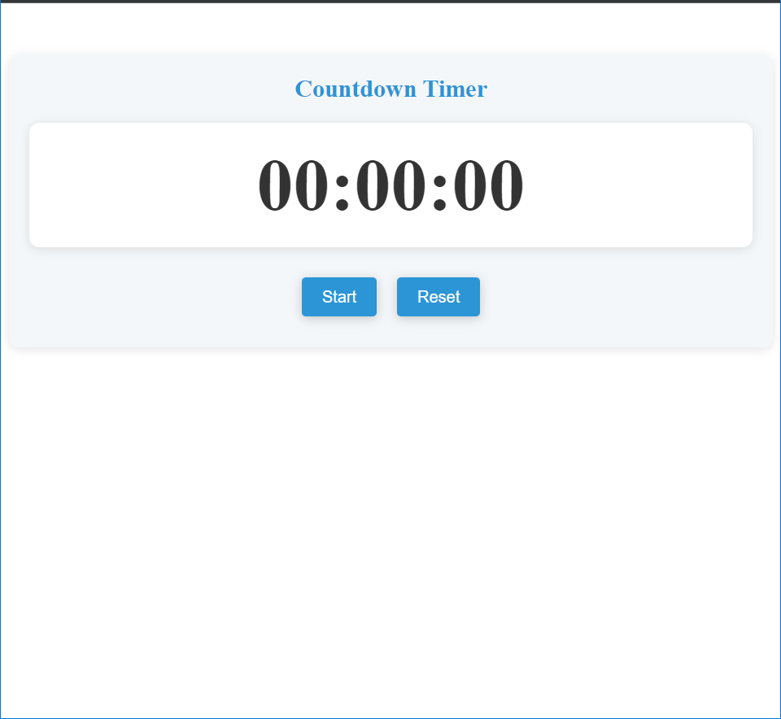
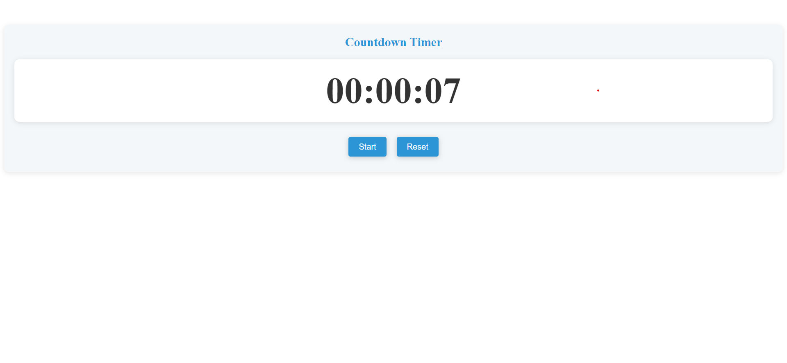

# Countdown Timer

A simple countdown timer with a visually appealing user interface built using JavaScript and CSS.
## Home Screen



## Demo



## Features

- Start the timer to begin counting up from 00:00:00
- Reset the timer to restart from 00:00:00

## Technologies Used

- HTML
- CSS
- JavaScript

```js
// Get DOM elements
const timerDisplay = document.getElementById('timer');
const startButton = document.getElementById('start');
const resetButton = document.getElementById('reset');

let timeInSeconds = 0;
let timerInterval;

function formatTime(time) {
  const hours = Math.floor(time / 3600);
  const minutes = Math.floor((time % 3600) / 60);
  const seconds = time % 60;

  return `${String(hours).padStart(2, '0')}:${String(minutes).padStart(2, '0')}:${String(seconds).padStart(2, '0')}`;
}

function startTimer() {
  if (!timerInterval) {
    timerInterval = setInterval(() => {
      timeInSeconds++;
      timerDisplay.textContent = formatTime(timeInSeconds);
    }, 1000);
  }
}

function resetTimer() {
  clearInterval(timerInterval);
  timerInterval = null;
  timeInSeconds = 0;
  timerDisplay.textContent = formatTime(timeInSeconds);
}

// Attach event listeners
startButton.addEventListener('click', startTimer);
resetButton.addEventListener('click', resetTimer);

```
## Code Explanation

The JavaScript code provides the functionality to start and reset the timer. Here's a brief explanation of the code:

1. The `timerDisplay`, `startButton`, and `resetButton` variables are used to reference the relevant DOM elements.

2. The `timeInSeconds` variable stores the elapsed time in seconds, and the `timerInterval` variable is used to keep track of the setInterval timer.

3. The `formatTime` function takes a time value in seconds and formats it into the "HH:MM:SS" format.

4. The `startTimer` function starts the timer by incrementing the `timeInSeconds` value and updating the timer display every second using `setInterval`.

5. The `resetTimer` function stops the timer by clearing the `timerInterval`, resetting the `timeInSeconds` to 0, and updating the timer display.

6. Event listeners are attached to the "Start" and "Reset" buttons to call the respective functions when clicked.


## License

This project is licensed under the MIT License. See the [LICENSE](LICENSE) file for more information.
