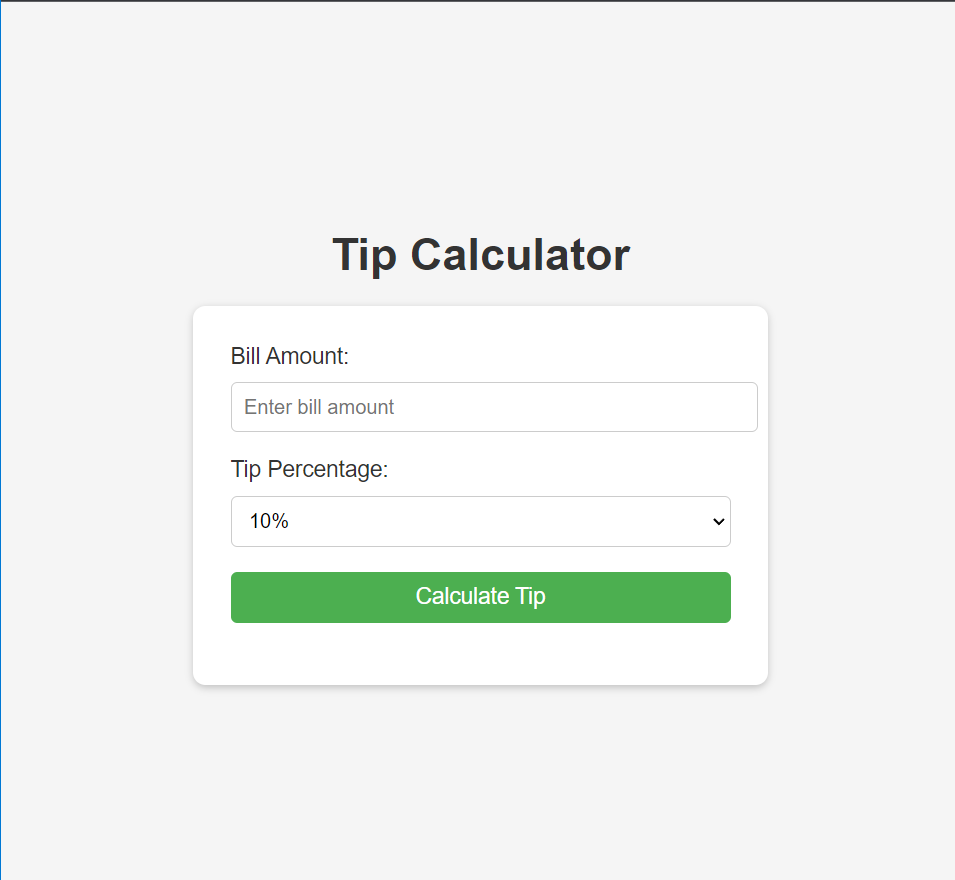

# Tip Calculator

This is a simple tip calculator web application built using JavaScript, HTML, and CSS.



## Introduction

The Tip Calculator allows users to calculate the tip amount based on the bill amount and the selected tip percentage. It provides a user-friendly interface where users can enter the bill amount, choose the tip percentage from a dropdown menu, and click the "Calculate Tip" button to see the calculated tip amount.

## JavaScript Code Explanation

The JavaScript code in `script.js` file handles the logic for calculating the tip amount and updating the display.

```javascript
function calculateTip() {
    // Get the bill amount and tip percentage
    var billAmount = parseFloat(document.getElementById("billAmount").value);
    var tipPercentage = parseFloat(document.getElementById("tipPercentage").value);
    
    // Calculate the tip amount
    var tipAmount = billAmount * tipPercentage;
    
    // Display the tip amount
    document.getElementById("tipAmount").textContent = "Tip Amount: $" + tipAmount.toFixed(2);
}
```
The `calculateTip()` function is triggered when the user clicks the "Calculate Tip" button. It performs the following steps:

1. Retrieves the bill amount and tip percentage from the respective input elements.
2. Calculates the tip amount by multiplying the bill amount with the tip percentage.
3. Displays the calculated tip amount in the `tipAmount` element.

Please note that this is a basic implementation and does not include error handling or validation. It assumes that the user will enter valid inputs.

## Getting Started

To use the Tip Calculator, follow these steps:

1. Clone the repository: `git clone https://github.com/your-username/tip-calculator.git`
2. Open the `index.html` file in a web browser.
3. Enter the bill amount and select the desired tip percentage.
4. Click the "Calculate Tip" button to see the calculated tip amount.

## License

This project is licensed under the MIT License.
