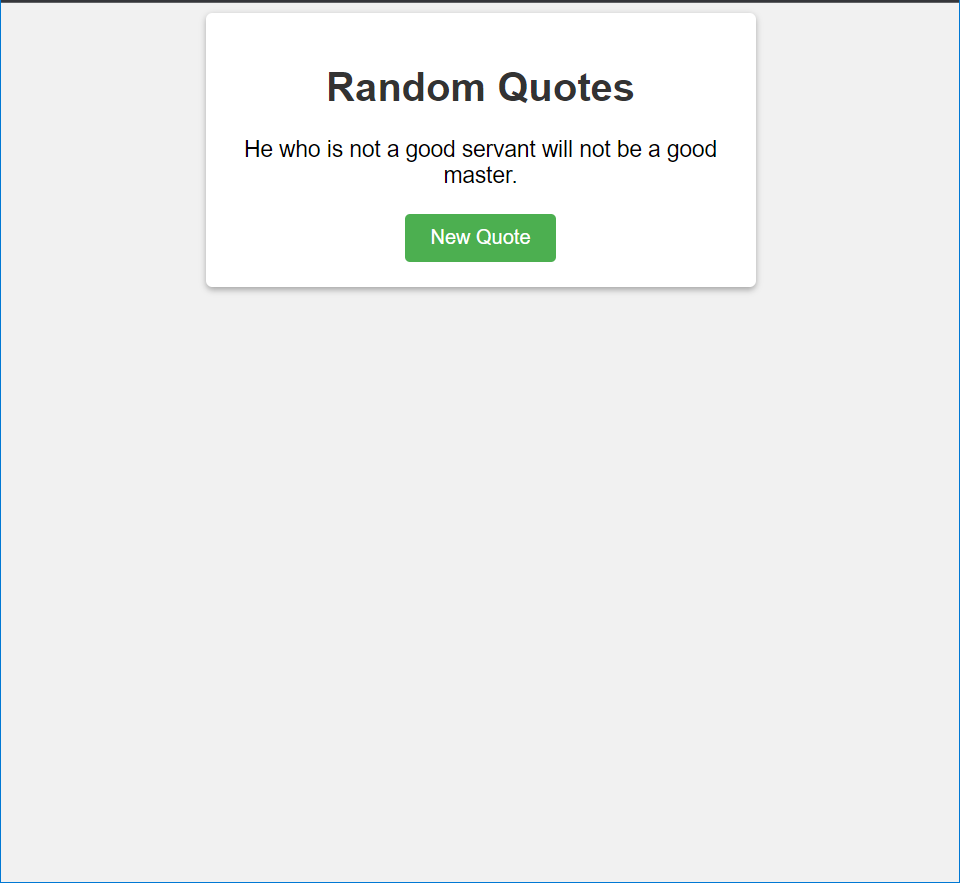

# Random Quotes Project

This is a basic Random Quotes project that displays a random quote each time the "New Quote" button is clicked. The project is built using HTML, CSS, and JavaScript.

## Preview

## Getting Started

To run this project locally, follow these steps:

1. Clone this repository: `git clone https://github.com/your-username/random-quotes.git`
2. Navigate to the project directory: `cd random-quotes`
3. Open the `index.html` file in a web browser.

## How It Works

The project consists of three files:

- `index.html`: Contains the HTML structure of the project.
- `style.css`: Defines the CSS styles for the project.
- `script.js`: Implements the JavaScript functionality to generate random quotes.

The `script.js` file contains an array of quotes. Each time the page loads or the "New Quote" button is clicked, a random quote is selected and displayed on the page.

## Customization

You can customize the project by modifying the list of quotes in the `script.js` file. Simply update the `quotes` array with your desired quotes.

Feel free to also customize the CSS styles in the `style.css` file to match your preferences.

## License

This project is licensed under the [MIT License](LICENSE).
