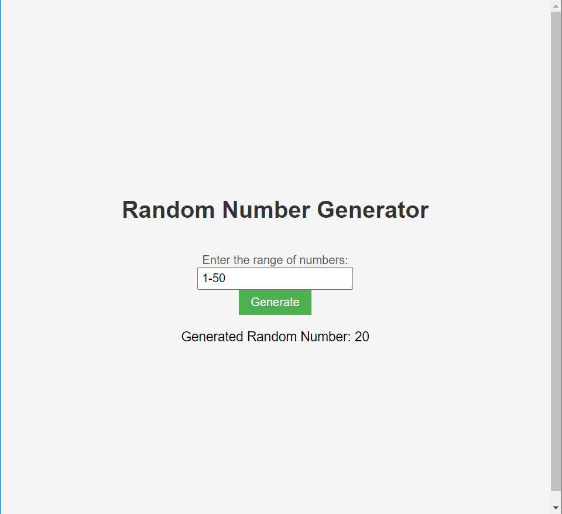

#Random Number Generator
=======================

This project is a simple Random Number Generator built using HTML, CSS, and JavaScript. It allows you to specify a range of numbers and generates a random number within that range.

How to Use
----------

1.  Clone the repository or download the project files.
2.  Open `index.html` in a web browser.
3.  Enter the desired range of numbers in the input field (e.g., 1-100).
4.  Click the "Generate" button.
5.  The generated random number within the specified range will be displayed below the button.

Code Explanation
----------------

The core functionality of the Random Number Generator is implemented in the `script.js` file. Let's break down the code:

    // Get the necessary elements from the HTML
    const rangeInput = document.getElementById('range');
    const generateBtn = document.getElementById('generateBtn');
    const resultDiv = document.getElementById('result');
    
    // Add an event listener to the button
    generateBtn.addEventListener('click', generateRandomNumber);
    
    // Function to generate a random number
    function generateRandomNumber() {
      const range = rangeInput.value;
    
      // Split the range input into minimum and maximum values
      const [min, max] = range.split('-');
    
      // Convert the values to integers
      const minValue = parseInt(min);
      const maxValue = parseInt(max);
    
      // Generate the random number within the range
      const randomNumber = Math.floor(Math.random() * (maxValue - minValue + 1)) + minValue;
    
      // Display the random number
      resultDiv.textContent = `Generated Random Number: ${randomNumber}`;
    }

Example Output
--------------

The output showcases the generated random number based on the user-defined range.

Feel free to customize the project based on your preferences. You can modify the styles in the CSS file (`style.css`) to change the appearance of the Random Number Generator. Additionally, you can update the JavaScript logic in the `script.js` file to add more features or enhance the functionality.

Enjoy generating random numbers with this simple and interactive Random Number Generator!
