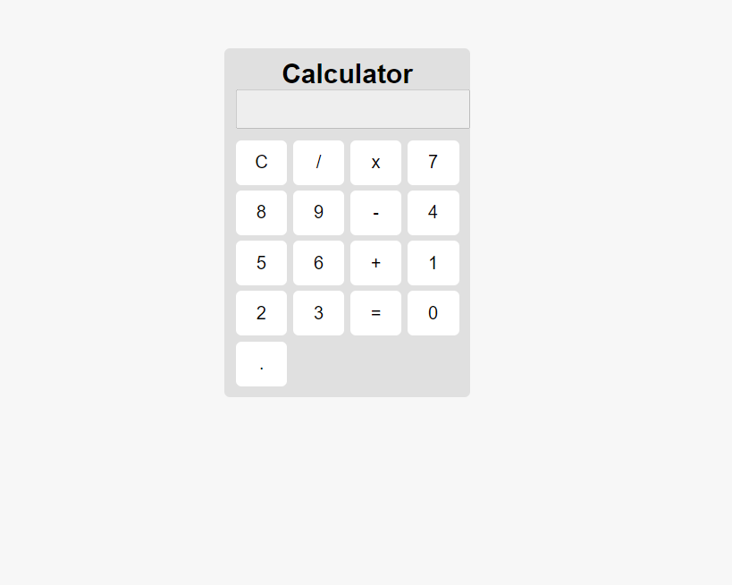

# Calculator Project

This is a simple calculator project implemented using HTML, CSS, and JavaScript. It provides basic arithmetic operations and allows users to perform calculations with ease.



## Project Overview

The calculator project consists of the following files:

- `index.html`: The HTML file containing the calculator interface.
- `styles.css`: The CSS file for styling the calculator interface.
- `script.js`: The JavaScript file containing the calculator logic.

## How to Use

1. Open the `index.html` file in a web browser.
2. Enter numerical values and perform calculations by clicking the calculator buttons.
3. The result will be displayed in the result field.

## HTML Documentation

To use the calculator, you need to include the following HTML structure in your `index.html` file:

```html
<!DOCTYPE html>
<html>
<head>
  <title>Calculator</title>
  <link rel="stylesheet" type="text/css" href="styles.css">
</head>
<body>
  <h1>Calculator</h1>
  <input type="text" id="resultField" disabled>
  <button onclick="clearResult()">C</button>
  <button onclick="appendToResult('/')">/</button>
  <button onclick="appendToResult('*')">x</button>
  <!-- Rest of the buttons -->
  <button onclick="calculateResult()">=</button>
  
  <script src="script.js"></script>
</body>
</html>
```
The above HTML structure includes the calculator title, result field, operator buttons, numerical buttons, and the equal button. Each button has an onclick attribute that calls the respective JavaScript function defined in the script.js file.

##CSS Styling
The CSS file styles.css contains the necessary styles to enhance the appearance of the calculator interface. Customize the styles in this file as per your requirements.

JavaScript Code Explanation
The JavaScript code provided in script.js contains the following functions:


```js
function clearResult() {
  // Function to clear the result field
  document.getElementById("resultField").value = "";
}

function appendToResult(value) {
  // Function to append a value to the result field
  document.getElementById("resultField").value += value;
}

function calculateResult() {
  // Function to calculate and display the result
  var result = eval(document.getElementById("resultField").value);
  document.getElementById("resultField").value = result;
}

```


The clearResult() function clears the result field by setting its value to an empty string.
The appendToResult(value) function appends the provided value to the result field.
The calculateResult() function evaluates the expression in the result field using the eval() function and displays the result in the result field.
Please make sure to include the necessary HTML, CSS, and JavaScript files in your project, and link the JavaScript functions to the respective buttons in the calculator interface.

Feel free to customize and enhance the code as needed for your specific requirements.
