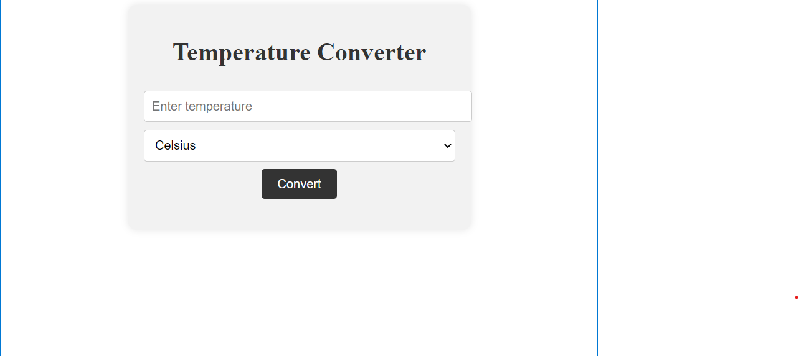

## Temperature Converter

This is a basic level project that demonstrates a temperature converter. It allows users to enter a temperature and select the unit (Celsius or Fahrenheit) they want to convert from. Upon clicking the "Convert" button, the equivalent temperature in the other unit is displayed.

### HTML
```html
<!DOCTYPE html>
<html>
<head>
  <title>Temperature Converter</title>
  <link rel="stylesheet" type="text/css" href="style.css">
</head>
<body>
  <div class="container">
    <h1>Temperature Converter</h1>
    <input type="number" id="inputTemp" placeholder="Enter temperature">
    <select id="inputUnit">
      <option value="celsius">Celsius</option>
      <option value="fahrenheit">Fahrenheit</option>
    </select>
    <button onclick="convertTemperature()">Convert</button>
    <h2 id="result"></h2>
  </div>

  <script src="script.js"></script>
</body>
</html>
```

```js
function convertTemperature() {
  // Retrieve the user input values
  var inputTemp = document.getElementById("inputTemp").value;
  var inputUnit = document.getElementById("inputUnit").value;
  
  // Get the element to display the result
  var result = document.getElementById("result");

  // Check the selected unit and perform the conversion
  if (inputUnit === "celsius") {
    // Convert Celsius to Fahrenheit
    var fahrenheit = (inputTemp * 9/5) + 32;
    result.innerHTML = inputTemp + "°C is equal to " + fahrenheit + "°F";
  } else if (inputUnit === "fahrenheit") {
    // Convert Fahrenheit to Celsius
    var celsius = (inputTemp - 32) * 5/9;
    result.innerHTML = inputTemp + "°F is equal to " + celsius + "°C";
  }
}


 ```

 The JavaScript code handles the conversion logic and updates the result dynamically based on user input.

- The `convertTemperature()` function is called when the "Convert" button is clicked.
- It retrieves the user input values:
  - `inputTemp` stores the value entered in the input field with the id "inputTemp".
  - `inputUnit` stores the value selected from the dropdown list with the id "inputUnit".
- The `result` variable is used to store the element where the result will be displayed. It is obtained using `getElementById("result")`.

- The code checks the selected unit using an `if-else` statement:
  - If the selected unit is "celsius", it performs the conversion from Celsius to Fahrenheit.
    - The calculated value is stored in the `fahrenheit` variable using the formula `(inputTemp * 9/5) + 32`.
    - The result is displayed in the `result` element using `innerHTML`.
  - If the selected unit is "fahrenheit", it performs the conversion from Fahrenheit to Celsius.
    - The calculated value is stored in the `celsius` variable using the formula `(inputTemp - 32) * 5/9`.
    - The result is displayed in the `result` element using `innerHTML`.
