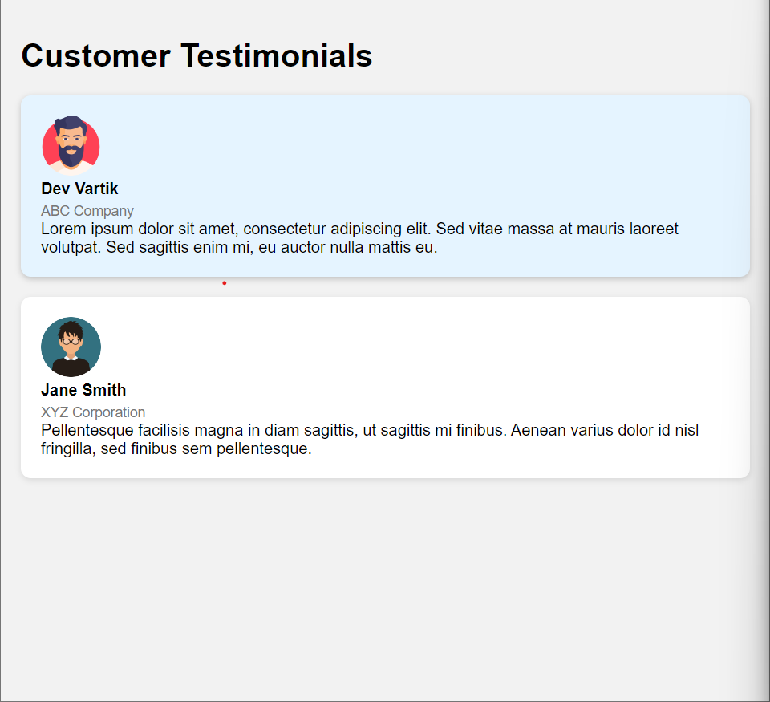

# Testimonials Project



This project displays customer testimonials on a webpage. It utilizes HTML, CSS, and JavaScript to create a user-friendly interface where testimonials are showcased. The testimonials are styled with CSS to provide a visually appealing layout, and JavaScript is used to add an interactive hover effect.

## Project Description

The project consists of three main files:

- `index.html`: Contains the HTML structure of the testimonials project, including the customer testimonials and their details.
- `styles.css`: Defines the CSS styles for the testimonials, such as layout, colors, and typography.
- `script.js`: Enhances the UI by adding a hover effect to the testimonials using JavaScript.

## Project Structure
```bash
testimonials-project
├── index.html
├── styles.css
└── script.js
```

## How to Use

1. Download or clone the repository to your local machine.
2. Open the `index.html` file in a web browser.
3. The testimonials will be displayed on the webpage, and you can hover over each testimonial to see the UI enhancement.

## Explanation of JavaScript Code

The JavaScript code in `script.js` adds an event listener to the testimonials when the DOM is fully loaded using `DOMContentLoaded`. It selects all the testimonial elements and attaches event listeners for mouseenter and mouseleave.

- When the mouse enters a testimonial, it adds the CSS class "highlight" to apply additional styles and create a visual effect.
- When the mouse leaves a testimonial, the "highlight" class is removed, reverting it to its original state.

This creates an interactive hover effect on the testimonials, providing a visually engaging user experience.

```javascript
window.addEventListener('DOMContentLoaded', function() {
  const testimonials = document.querySelectorAll('.testimonial');

  testimonials.forEach(function(testimonial) {
    testimonial.addEventListener('mouseenter', function() {
      this.classList.add('highlight');
    });

    testimonial.addEventListener('mouseleave', function() {
      this.classList.remove('highlight');
    });
  });
});
```

## Event Listener Registration:
```js
window.addEventListener('DOMContentLoaded', function() {
  // Code goes here
});


```
The DOMContentLoaded event listener is registered to ensure that the JavaScript code executes when the DOM (Document Object Model) is fully loaded and parsed.


## Testimonial Elements Selection:

```js
const testimonials = document.querySelectorAll('.testimonial');

```
The document.querySelectorAll('.testimonial') selects all the elements with the class name "testimonial" and returns a NodeList containing those elements. This NodeList is stored in the testimonials variable for further processing.

## Mouse Enter and Mouse Leave Event Listeners:
```js
testimonials.forEach(function(testimonial) {
  testimonial.addEventListener('mouseenter', function() {
    this.classList.add('highlight');
  });

  testimonial.addEventListener('mouseleave', function() {
    this.classList.remove('highlight');
  });
});

```
Using the forEach method, we iterate over each testimonial element in the testimonials NodeList. For each testimonial, two event listeners are added:

Mouse Enter Event Listener: When the mouse enters a testimonial element, the callback function is executed. It adds the CSS class "highlight" to the testimonial element using this.classList.add('highlight'). This class is used to apply additional styles and create a visual effect.

Mouse Leave Event Listener: When the mouse leaves a testimonial element, the callback function is executed. It removes the CSS class "highlight" from the testimonial element using this.classList.remove('highlight'), reverting it to its original state.

The combination of these event listeners and class manipulation creates a hover effect on the testimonials, adding a highlight to the respective testimonial element.


