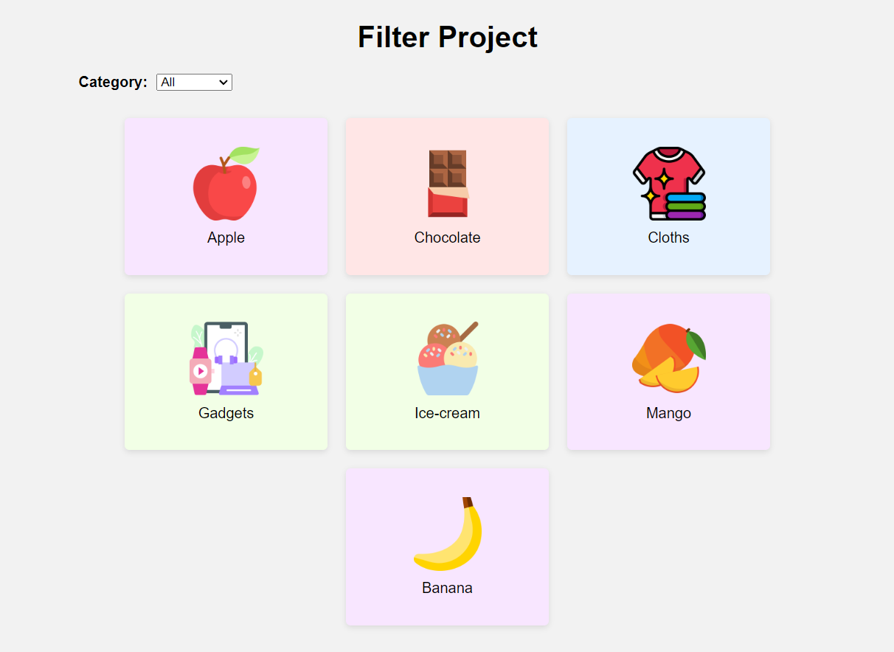
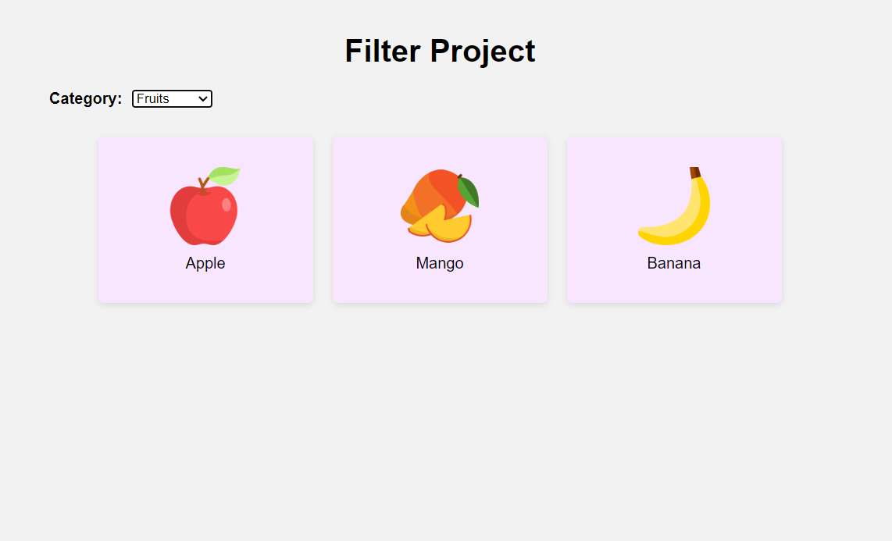

# Filter Project



## Description

The Filter Project is a web application that allows users to filter and sort data based on different categories. It provides a user-friendly interface to browse and narrow down the displayed items according to their preferences.

## Features

- Interactive filtering: Users can select a category from the dropdown menu to filter the displayed items.
- Dynamic data rendering: The items are dynamically rendered based on the selected category.
- Responsive design: The project is built with responsive design principles, ensuring optimal user experience across different devices.

## Screenshots

### Home Page


### Filtering Example



## Code Explanation

The functionality of the Filter Project is achieved using HTML, CSS, and JavaScript. Here's an overview of the code:

- HTML: The HTML structure defines the layout of the web page, including the filter dropdown and the container for displaying the filtered items.

- CSS: The CSS file provides the styles and layout properties to create an attractive user interface. It includes styles for the container, filters, item cards, and images.

- JavaScript: The JavaScript code handles the filtering logic. It listens for changes in the category dropdown and dynamically filters the items based on the selected category. It applies the appropriate CSS styles to show or hide the items accordingly.

```js
const categorySelect = document.getElementById("category");
const items = document.querySelectorAll(".item");

categorySelect.addEventListener("change", filterItems);

function filterItems() {
  const selectedCategory = categorySelect.value;

  items.forEach((item) => {
    if (selectedCategory === "all" || item.classList.contains(selectedCategory)) {
      item.style.display = "flex";
    } else {
      item.style.display = "none";
    }
  });
}

```

## Explanation

The JavaScript code is responsible for handling the filtering functionality of the Filter Project. Here's a step-by-step explanation of the code:

1. The `categorySelect` variable is used to store the HTML element with the ID "category" using `document.getElementById("category")`.

2. The `items` variable is used to store a collection of HTML elements with the class "item" using `document.querySelectorAll(".item")`.

3. An event listener is added to the `categorySelect` element to listen for changes. Whenever the user selects a different category, the `filterItems` function will be called.

4. The `filterItems` function is responsible for filtering the items based on the selected category.

5. The selected category is obtained by accessing the `value` property of the `categorySelect` element (`categorySelect.value`).

6. The `forEach` method is used to iterate through each item in the `items` collection.

7. For each item, the code checks if the selected category is "all" (indicating that all items should be displayed) or if the item has the selected category as a class using `item.classList.contains(selectedCategory)`.

8. If either condition is true, the item is displayed by setting its `display` style property to "flex" (`item.style.display = "flex"`).

9. If neither condition is met, indicating that the item does not belong to the selected category, the item is hidden by setting its `display` style property to "none" (`item.style.display = "none"`).


Feel free to explore the code in the provided HTML, CSS, and JavaScript files to get a detailed understanding of how the filtering functionality is implemented.

## Usage

1. Clone the repository: `git clone <repository-url>`
2. Open the project directory.
3. Open the `index.html` file in a web browser.
4. Use the category dropdown to filter and sort the displayed items.

## License

This project is licensed under the [MIT License](LICENSE).
