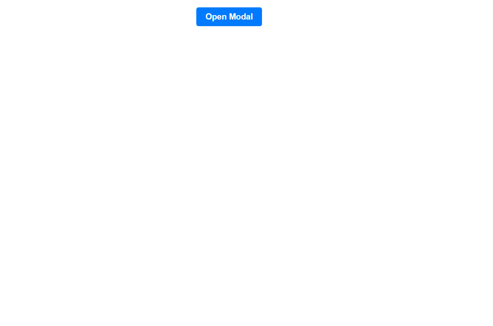
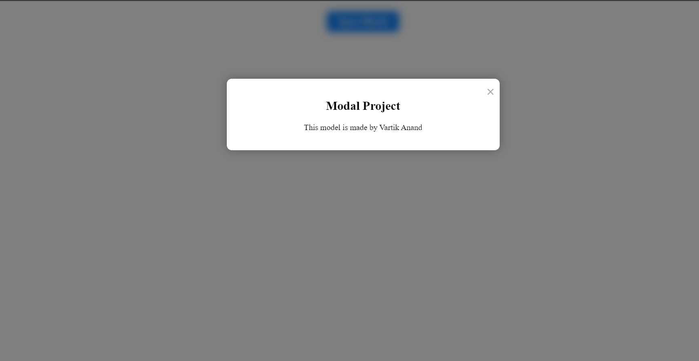

# Modal Project

This project demonstrates the implementation of a modal (popup) window using HTML, CSS, and JavaScript. The modal provides a way to display additional content or interactive elements on top of the main webpage.

## Demo

### Home Page


### Modal Window


## Features

- Clicking the "Open Modal" button triggers the modal to appear on the screen.
- The modal contains a title and content area.
- A close button is provided to dismiss the modal.

## Technologies Used

- HTML
- CSS
- JavaScript

## Code Explanation

The project consists of three main files: `index.html`, `styles.css`, and `script.js`. Here's a breakdown of each file and its purpose:

### index.html

The HTML file sets up the basic structure of the webpage. It includes a button to open the modal and the modal itself.

- The "Open Modal" button is defined with the `openModalBtn` ID.
- The modal container is defined with the `modal` ID.
- The modal content is defined within the `modal-content` class.

### styles.css

The CSS file contains styles to enhance the appearance of the webpage and the modal.

- The `.modal` class defines the styling for the modal container, including its position, size, and background.
- The `.modal-content` class defines the styling for the modal content, such as its background, padding, and box shadow.
- The `.close` class styles the close button, positioning it in the top right corner.
- The `.btn` class styles the button, providing a background color, padding, and hover effect.

### script.js

The JavaScript file handles the functionality of the modal.

- The `openModal` function is triggered when the "Open Modal" button is clicked. It sets the display of the modal to block, making it visible.
- The `closeModal` function is triggered when the close button or the background overlay is clicked. It sets the display of the modal to none, hiding it.
- Event listeners are added to the open and close buttons to execute the corresponding functions.
## JavaScript Code Explanation

The JavaScript code handles the functionality of the modal window. Here's a breakdown of the code:

```javascript
// Get the modal element
const modal = document.getElementById('modal');

// Get the open modal button element
const openModalBtn = document.getElementById('openModalBtn');

// Get the close button element
const closeBtn = document.getElementById('closeBtn');

// Function to open the modal
function openModal() {
  modal.style.display = 'block';
}

// Function to close the modal
function closeModal() {
  modal.style.display = 'none';
}

// Event listener for the open modal button
openModalBtn.addEventListener('click', openModal);

// Event listener for the close button
closeBtn.addEventListener('click', closeModal);
```
## Explanation

The JavaScript code for the modal project handles the functionality of the modal window. Here's a breakdown of the code:

1. The `modal` variable is used to store a reference to the modal element.
2. The `openModalBtn` variable is used to store a reference to the open modal button element.
3. The `closeBtn` variable is used to store a reference to the close button element.
4. The `openModal` function is responsible for displaying the modal by changing its `display` style property to `'block'`.
5. The `closeModal` function is responsible for hiding the modal by changing its `display` style property to `'none'`.
6. An event listener is added to the open modal button, which triggers the `openModal` function when clicked.
7. Similarly, an event listener is added to the close button, which triggers the `closeModal` function when clicked.
8. To implement this code, make sure to replace the references to the modal, open modal button, and close button elements with the appropriate selectors or IDs used in your HTML.


## Usage

To use this project, follow these steps:

1. Download the project files (index.html, styles.css, script.js).
2. Open the index.html file in a web browser.
3. Click the "Open Modal" button to see the modal window.
4. Click the close button or the background overlay to dismiss the modal.

Feel free to modify the styles and content of the modal to suit your specific needs.

