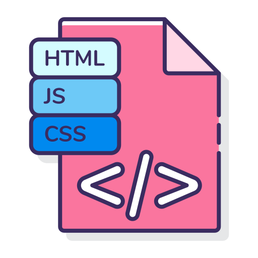

# JavaScript 100+ Projects

# JavaScript Mastery Vault: 100+ Projects

Welcome to the JavaScript Mastery Vault, a curated collection of 100+ JavaScript projects designed to guide learners from basic concepts to advanced techniques. Whether you're a beginner seeking to build a strong foundation in JavaScript or an experienced developer looking to enhance your skills, this repository is your go-to resource!

## About the Repository

This repository serves as a comprehensive learning tool, offering a wide range of projects covering various aspects of JavaScript. Each project is carefully crafted to address specific concepts, patterns, and technologies. The projects are organized in ascending order of complexity, allowing you to progress at your own pace.

## Project Structure

The repository follows a structured format to ensure an organized learning experience. Here's an overview of the project structure:

- Each project is contained within its own directory, named according to its topic or functionality.
- Inside each project directory, you'll find a README file providing a brief description, objectives, and instructions.
- The project's source code and any associated assets are included within the project directory.
- Additional resources, if required, will be provided alongside the project.

# Git Project List

This is a list of projects developed for Git:

## [1. Change Background Color Project](1%20Change%20Background%20Color)
Description: A project that allows changing the background color of a webpage dynamically.

## [2. Hex Change Background Color Project](https://github.com/VartikAnand/JavaScript-Mastery-Vault-100--Project-s/tree/main/2%20Hex%20Change%20Background%20Color)
Description: A project that enables changing the background color of a webpage using hexadecimal color codes.

## [3. Random Quotes Project](https://github.com/VartikAnand/JavaScript-Mastery-Vault-100--Project-s/tree/main/3.Random%20Quotes%20Project)
Description: A project that displays random quotes on a webpage.

## [4. Pass the Message Project](https://github.com/VartikAnand/JavaScript-Mastery-Vault-100--Project-s/tree/main/4.Random%20Number%20Generator)
Description: A project that passes a message from one user to another.

## [5. Counter Project](#counter-project)
Description: A project that increments or decrements a counter on a webpage.

## [6. Background Image Slider Project](#background-image-slider-project)
Description: A project that creates a slider to showcase multiple background images on a webpage.

## [7. Testimonials Project](#testimonials-project)
Description: A project that displays customer testimonials on a webpage.

## [8. Filter Project](#filter-project)
Description: A project that allows filtering and sorting data on a webpage.

## [9. Modal Project](#modal-project)
Description: A project that creates a modal or popup window on a webpage.

## [10. Calculator Project](#calculator-project)
Description: A project that implements a basic calculator functionality on a webpage.

## [11. Tip Form Project](#tip-form-project)
Description: A project that calculates tip amounts based on user input in a form.

## [12. To-Do List Project](#to-do-list-project)
Description: A project that helps manage and organize tasks in a to-do list format.

## Getting Started

To get started with the JavaScript Mastery Vault, follow these steps:

1. Clone the repository to your local machine using the following command:

    `git clone https://github.com/VartikAnand/JavaScript-Mastery-Vault-100--Project-s.git`

2. Navigate to the project directory you wish to explore:

    `cd project-directory`

Read the project's README file to understand its objectives and instructions.

Explore the source code and any provided assets to gain hands-on experience.

Repeat the above steps for each project, progressing from beginner to advanced levels.

## Contribution

We welcome contributions to the JavaScript Mastery Vault! If you have an idea for a new project, or you'd like to improve an existing one, please follow these steps:

1. Fork the repository.
2. Create a new branch with a descriptive name for your contribution:

    `git checkout -b new-feature`

Make your desired changes and improvements.

Commit your changes with a clear and concise message:

    `git commit -m "Add new feature: Description of the feature"`

Push your changes to your forked repository:

    `git push origin new-feature`

Open a pull request, explaining the purpose and benefits of your contribution.

We'll review your pull request and work with you to merge it into the main repository.

## Support

If you encounter any issues, have questions, or need assistance with a specific project, feel free to open an issue in this repository. We'll be glad to help!

## License

The JavaScript Mastery Vault is MIT licensed. Feel free to use the projects for personal learning, education, or even in commercial projects.

Happy coding and enjoy your journey to JavaScript mastery!
